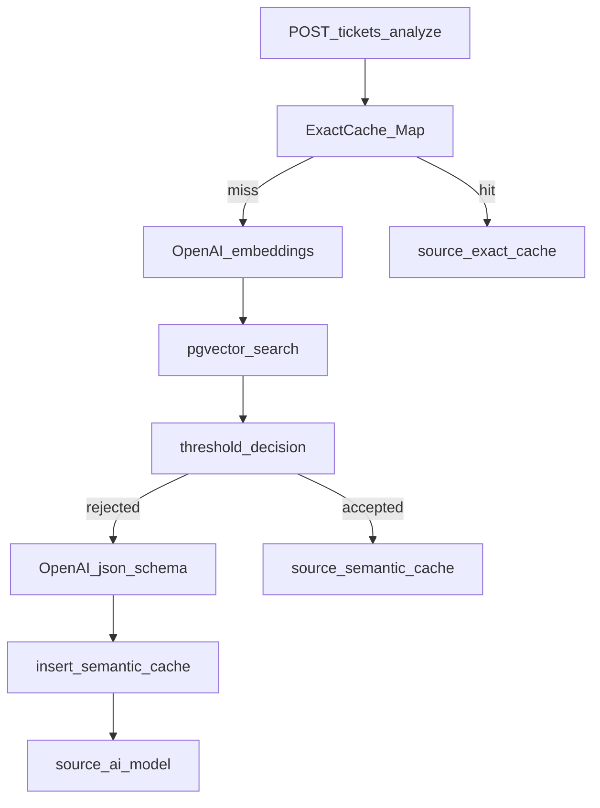

# Port TypeScript (Hono) + remote pessoal

## Decisões travadas

- **HTTP:** [Hono](https://hono.dev/) + `@hono/node-server`
- **IA (fase 1):** SDK oficial `openai` — chat com `response_format: { type: "json_schema", json_schema: ... }` e embeddings com `embeddings.create`
- **Validação HTTP:** Zod (request/response da API), espelhando [models.py](../../models.py)
- **DB:** `pg` + SQL equivalente a [db.py](../../db.py); manter [docker-compose.yml](../../docker-compose.yml)
- **Python:** remover arquivos `.py` / `requirements.txt` do root após o port (repo pessoal fica 100% TS)
- **Git remote:** trocar `origin` de `devfullcycle/mba-ia-cache` para [https://github.com/ramos-neo/cache-semantico.git](https://github.com/ramos-neo/cache-semantico.git) e publicar o código TS
- **Fase 2 (não implementar agora):** LangChain.js como provider alternativo de chat/embeddings, atrás da mesma interface

## Esqueleto de pastas

```
cache-semantico/
├── docker-compose.yml          # mantido
├── .env.example                # mantido (mesmas vars)
├── .gitignore                  # Node + .env
├── package.json
├── tsconfig.json
├── README.md                   # setup TS + fluxo de cache
├── test.http                   # mesmos endpoints
└── src/
    ├── index.ts                # bootstrap Hono + initDb no startup
    ├── app.ts                  # app Hono, monta rotas
    ├── config.ts               # env + runtime_config
    ├── log.ts                  # log em bloco (log_helpers)
    ├── fingerprint.ts          # normalize, buildFingerprint, buildCacheKey
    ├── schemas/
    │   └── ticket.ts           # Zod + JSON Schema do TicketAnalysis (OpenAI)
    ├── db/
    │   └── index.ts            # initDb, getDbStatus, insert, searchSimilar
    ├── ai/
    │   ├── openai-client.ts    # cliente OpenAI
    │   ├── classify.ts         # chat + json_schema → TicketAnalysis
    │   └── embeddings.ts       # embedQuery / embedDocuments
    ├── cache/
    │   ├── exact.ts            # Map em memória
    │   └── semantic.ts         # evaluateBestMatch, saveAiResult
    └── routes/
        ├── config.ts           # GET/PUT /config
        ├── db.ts               # GET /db/status
        ├── tickets.ts          # POST /tickets/analyze (cascata)
        ├── embeddings.ts       # POST /embeddings/generate
        └── semantic-cache.ts   # items / search / evaluate
```

Contratos e comportamento de [main.py](../../main.py) permanecem: mesmas rotas, mesmas fontes (`exact_cache` | `semantic_cache` | `ai_model`), mesmos campos de telemetria.

## Fluxo (inalterado)



## OpenAI JSON Schema (fase 1)

Em `src/schemas/ticket.ts` / `src/ai/classify.ts`:

- Definir o schema JSON de `TicketAnalysis` (`category` enum, `confidence`, `reason`) com `strict: true`
- Chamar `client.chat.completions.create` com `response_format: { type: "json_schema", json_schema: { name, strict, schema } }`
- `JSON.parse` do conteúdo + validação Zod defensiva
- Prompt system/human equivalente ao de [main.py](../../main.py) (linhas 70–81)

Embeddings: `text-embedding-3-small`, dimensão 1536 (env), igual ao `.env.example`.

## Mapeamento Python → TS

| Origem | Destino |
|--------|---------|
| [config.py](../../config.py) | `src/config.ts` |
| [db.py](../../db.py) | `src/db/index.ts` |
| [models.py](../../models.py) | `src/schemas/ticket.ts` (+ schemas Zod por rota) |
| [log_helpers.py](../../log_helpers.py) | `src/log.ts` |
| [main.py](../../main.py) rotas/fluxo | `src/routes/*` + `src/cache/*` + `src/ai/*` |
| `CACHE` dict / `ai_call_count` | `src/cache/exact.ts` |

## Scripts e runtime

- `package.json`: `dev` (`tsx watch src/index.ts`), `start` (`node dist/index.js`), `build` (`tsc`)
- Porta `8000` (compatível com `test.http`)
- Dependências: `hono`, `@hono/node-server`, `openai`, `pg`, `zod`, `dotenv`, `uuid`; tipos `@types/pg`, `@types/node`, `typescript`, `tsx`

## Git / GitHub

1. Após o port e README TS: remover artefatos Python do tracking
2. `git remote set-url origin https://github.com/ramos-neo/cache-semantico.git`
3. Commit único (ou commits claros) do port TS
4. `git push -u origin main` (repo pessoal está vazio)

Não versionar `.env` (já no `.gitignore`).

## Fase 2 — LangChain (estudo, fora deste port)

Adiar implementação. Preparar só o gancho mental:

- Extrair interface `Classifier` / `Embedder` em `src/ai/`
- Fase 1: implementação `openai` (JSON Schema)
- Fase 2: pasta `src/ai/langchain/` com LangChain.js (`ChatOpenAI` + structured output / embeddings), selecionável por env `AI_PROVIDER=openai|langchain`

Não instalar LangChain nesta fase.

## Critérios de pronto

- `docker compose up -d` + `npm run dev` sobe e `GET /db/status` ok
- Cascata exact → semantic → AI → write funciona como no Python
- `PUT /config` ajusta threshold
- Código no GitHub [ramos-neo/cache-semantico](https://github.com/ramos-neo/cache-semantico)
